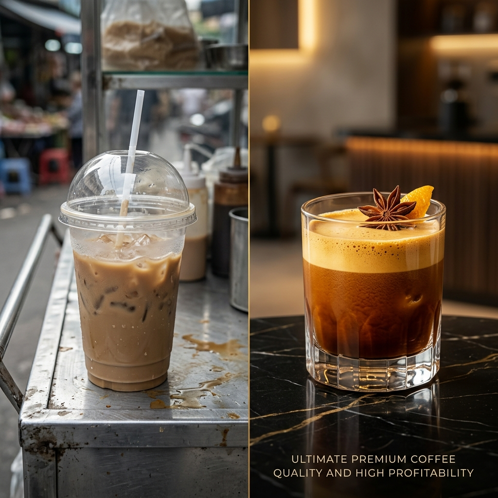

**(Định dạng: Hình ảnh so sánh thực tế - Đã xuất xưởng bởi AME AI)**

Ly cà phê 15k mà lấy hạt qua đại lý: hết lãi.
Lấy hạt rẻ trôi nổi: hết khách.

Đó là lý do Cà Phê Nhân Tâm ra đời. ☕

Xưởng rang nội đô TP.HCM. Hạt đi thẳng đến xe đẩy của bạn — không trung gian, không cắt phế.

✅ Giá sàn từ xưởng → biên lợi nhuận mở rộng ngay
✅ 100% hạt mộc, không tẩm — khách ghiền không rời
✅ Mix & Match tự do: Robusta / Arabica / Culi theo tỷ lệ riêng của quán
✅ Giao nội đô trong ngày — hết hạt 9h tối vẫn có hàng sáng hôm sau

---

🎁 **TẶNG 200g MẪU THỬ "SÀI GÒN BOLD" — 0 ĐỒNG**
Dòng hạt chuyên máy ép, crema dày, đắng đậm đúng gu Sài Gòn.
*(Bạn chỉ trả 30k phí ship nội thành)*

📩 Nhắn Zalo **[SỐ ĐIỆN THOẠI]** hoặc inbox Fanpage — xưởng phản hồi và lên bill trong 15 phút.
👉 Link Zalo OA: **[ZALO_OA_LINK]**

#CafeNhanTam #HatRangMoc #StartupFnB #GiaXuong

#CaPheNhanTam #HatMocNguyenBan #XuongRangSaiGon #StartupCaPhe #GiaVonCaPhe
